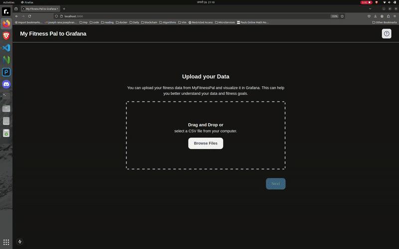

# MyFitnessPal to Grafana

**Easily visualize your MyFitnessPal data with the power of Grafana.**

<figure>
  
</figure>

This project is built using **Next.js 15** to provide seamless integration between MyFitnessPal and Grafana for better data visualization.

## Features

- Visualize workout and nutrition data on customizable Grafana dashboards
- Easy setup and configuration with environment variables

## Installation & Running the Project

To get started, clone the repository and install the dependencies:

```bash
git clone <repository-url>
cd <project-folder>
yarn install
```
Once the dependencies are installed, run the development server:
````
yarn dev
````
The application will be running at http://localhost:3000.

**Note**:Make sure the grafana instance and database are also running

## Configuration


- DATABASE_URL
- NEXT_PUBLIC_GRAFANA_DASHBOARD_URL


Ensure your Grafana instance is configured to allow embedding. Update the Grafana .ini file with the following settings:

Allow embedding in your Grafana settings:

    Open the grafana.ini file (usually located at /etc/grafana/grafana.ini).
    Under [security], set allow_embedding = true.
    cookie_samesite = none

Configure your Grafana dashboard for API access:

    Make sure your Grafana instance is properly set up to allow API access for embedding and data visualization.